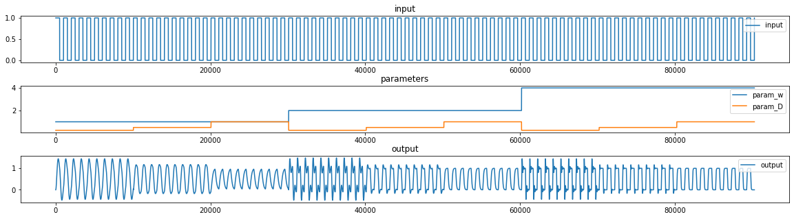

# ode-datasets

This repo contains an assembly of datasets, demonstrating the time-series behavior of a PT-1, PT-2 and PT-1 + PT-2 element that are fed with a square input function.
The simulations are done in OpenModelica. The simulation models are saved in the directories.

### Quickrun

Open the Simulation models in OMEdit. Define runtime environment and hyperparameters and run 

### Models

The simulation time for one model state is 10,000 samples. The variables $T$ for the PT-1 element is parametrized 1, 2, 4, as well as the variables $w$ and $D$ for the PT-2 element. 
All meaningful hyperparameter permutations were applied, as soon as parameters canceled each other, the hyperparameter setting was abandoned. 

##### PT-1 element

A single PT-1 element with hyperparameter $T$ and square input function of frequency 1,000 s

##### PT-2 element

A single PT-2 element with hyperparameters $w$, $D$ and square input function of frequency 1,000 s

##### PT-1 + PT-2 element

A PT-1 element in serial connection to a PT-2 element with hyperparameters $T$, $w$, $D$ and square input function of frequency 1,000 s

 
